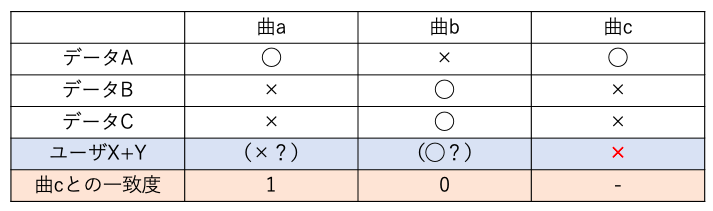

# 概要
卒業研究の実験用に作成した、個人的ノスタルジアが喚起される（懐かしい）曲の推薦システムです。2人のユーザが同時にシステムにアクセスし、スタートボタンを押すと曲の推薦が始まります。ボタンを押すたびに、協調フィルタリングを利用したアルゴリズムで曲が切り替わっていきます。2人とも個人的ノスタルジアが喚起される曲を見つけることを支援することを目的とします。

使用言語はHTML、CSS、JavaScriptで、FirebaseのRealtime Databaseでデータの管理をしています。

 

# アルゴリズム
他人と個人的な出来事が共通している可能性があることを考えれば、他人の個人的ノスタルジアは自分の個人的ノスタルジアに類似している可能性があります。そこで、他人がどんな曲に個人的ノスタルジアが喚起されるかを記録したデータベースを用意し、ユーザとの一致度を計算することで、効率的に両者とも個人的ノスタルジアが喚起される曲が推薦できると考え、協調フィルタリングを利用したアルゴリズムを実装しました。

どのようなアルゴリズムで曲が推薦されるかを、下の表を例に説明します。データベースのアンケート回答結果は、個人的ノスタルジアが喚起された場合を◯、喚起されなかった場合を×とします。また、2人のユーザの回答は、両者とも個人的ノスタルジアが喚起された場合を◯、それ以外の場合を×とします。例えばユーザXとYに曲cが提示され、両者ともに個人的ノスタルジアが喚起される条件ではなかったとします。すると、曲cとの一致度は曲aは1、曲bは0と計算できます。曲aの一致度は1であるので、ユーザX+Yは曲aに対して、両者ともに個人的ノスタルジアが喚起される条件ではないと予想できます。一方で、曲bの一致度は0であるので、ユーザX+Yは曲bに対して、両者ともに個人的ノスタルジアが喚起されると予想できます。

    

 

# デモ
https://nostalgia-recommendation.web.app/

※研究の実験用に作成したものです。一般の方が触っても面白くはありません。